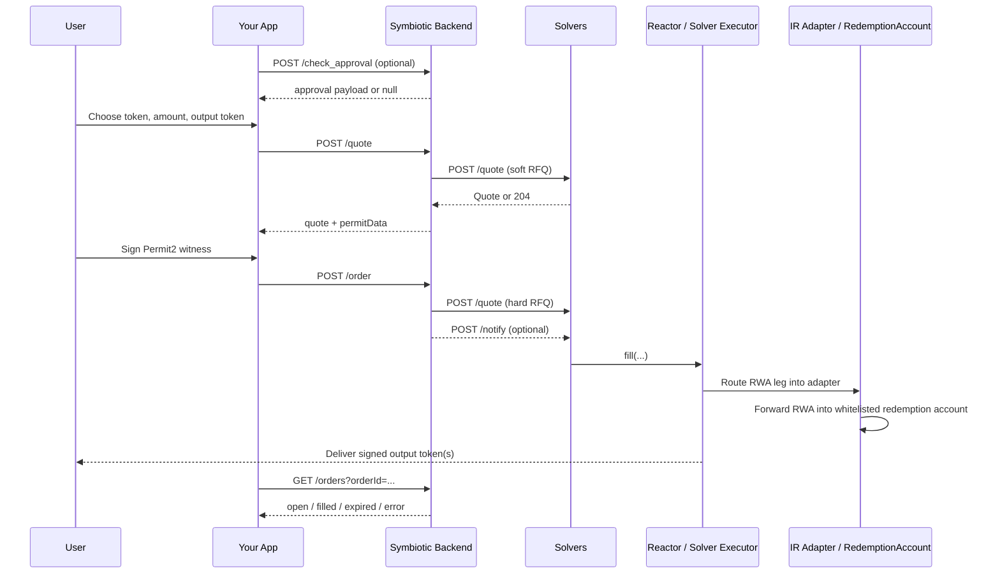

# Integrate Instant Redemptions Into Your App

This is the standard integration path. If you want users to redeem a supported RWA from inside your product, start here.

Your app owns the wallet and signing experience. Symbiotic owns the private RFQ, solver selection, and canonical order tracking. The result is a familiar flow for the user: get a quote, sign once, submit once, and track status until settlement finishes.

## What you own vs. what Symbiotic owns

Your app owns:

- wallet connection
- token and amount selection
- approval handling
- Permit2 signature collection
- order-status UI
- optional fee or referral outputs

Symbiotic owns:

- quote orchestration
- solver fanout
- hard re-quote and winner selection
- order creation
- order lifecycle tracking

## End-to-end flow



## 1. Optionally check Permit2 approval

Call `POST /check_approval` when you are not sure whether the user has already approved Permit2 for the input RWA token.

Request:

```json
{
  "walletAddress": "0xUser",
  "chainId": 1,
  "token": "0xACRED",
  "amount": "100000000"
}
```

Response:

```json
{
  "requestId": "uuid",
  "approval": {
    "to": "0xPermit2",
    "data": "0x...",
    "value": "0"
  },
  "cancel": null
}
```

What to do with the response:

- If `approval` is `null`, move straight to quoting.
- If `approval` is present, submit that transaction first.
- Treat all token amounts as integer strings in base units.

## 2. Request a quote

Call `POST /quote` with the exact input amount and the output recipients you want enforced onchain.

Request:

```json
{
  "tokenInChainId": 1,
  "tokenOutChainId": 1,
  "tokenIn": "0xACRED",
  "tokenOut": "0xUSDC",
  "type": "EXACT_INPUT",
  "amount": "100000000",
  "swapper": "0xUser",
  "slippageTolerance": 0.5,
  "routingPreference": "BEST_PRICE",
  "outputs": [
    { "token": "0xUSDC", "recipient": "0xUser" },
    { "token": "0xUSDC", "recipient": "0xReferrer", "portionBps": 10 }
  ]
}
```

Response:

```json
{
  "requestId": "uuid",
  "routing": "Priority",
  "quote": {
    "quoteId": "uuid",
    "slippageTolerance": 0.5,
    "aggregatedOutputs": [
      { "token": "0xUSDC", "amount": "99750000" }
    ],
    "orderInfo": {
      "tokenIn": "0xACRED",
      "amountIn": "100000000",
      "outputs": [
        { "token": "0xUSDC", "amount": "99650250", "recipient": "0xUser" },
        { "token": "0xUSDC", "amount": "99750", "recipient": "0xReferrer" }
      ],
      "deadline": 1712345700,
      "nonce": "0x..."
    }
  },
  "permitData": {
    "domain": { "...": "..." },
    "types": { "...": "..." },
    "value": { "...": "..." }
  }
}
```

Rules that matter:

- `type` is currently `EXACT_INPUT` only.
- `routingPreference` is `BEST_PRICE` or `FASTEST`.
- At least one output is required.
- Exactly one output should omit `portionBps`. That output receives the remainder after fixed-bps outputs are allocated.
- `quote.orderInfo.outputs` are the signed minimum obligations that `Reactor` will enforce.
- If you support native ETH payout, use `0x0000000000000000000000000000000000000000` as the output token sentinel.
- A no-quote response is `404`, not an empty `200`.

## 3. Ask the user to sign, then create the order

The quote response includes `permitData`, which the user signs through Permit2 witness transfer. After the wallet returns the signature, submit the same `quote` object plus the signature to `POST /order`.

Request:

```json
{
  "quote": {
    "quoteId": "uuid",
    "slippageTolerance": 0.5,
    "aggregatedOutputs": [
      { "token": "0xUSDC", "amount": "99750000" }
    ],
    "orderInfo": {
      "tokenIn": "0xACRED",
      "amountIn": "100000000",
      "outputs": [
        { "token": "0xUSDC", "amount": "99650250", "recipient": "0xUser" },
        { "token": "0xUSDC", "amount": "99750", "recipient": "0xReferrer" }
      ],
      "deadline": 1712345700,
      "nonce": "0x..."
    }
  },
  "signature": "0xPermit2WitnessSig"
}
```

Response:

```json
{
  "requestId": "uuid",
  "orderId": "uuid",
  "orderStatus": "open"
}
```

What happens after submission:

- The backend verifies the user signature.
- The backend reruns a hard RFQ against the signed quote.
- The backend binds the winning filler into the final order.
- The solver fills onchain or the order later expires.

Important failure modes:

- `404` means the `quoteId` is unknown.
- `409` means the quote expired or can no longer be honored at the signed bounds.
- Repeated submissions with the same quote and signature are deduped server-side.

## 4. Poll order status

Use `GET /orders` to power the order history and pending-state UX.

Recommended patterns:

- Single order view: `GET /orders?orderId=<uuid>`
- Active orders for one wallet: `GET /orders?swapper=<wallet>&orderStatus=open`
- Historical page: `GET /orders?swapper=<wallet>&limit=20&sort=desc`

Public statuses today:

- `open`
- `filled`
- `expired`
- `error`
- `cancelled`
- `unverified`
- `insufficient-funds`

Only the filler-scoped open view exposes executable fields such as `encodedOrder`, `signature`, `deadline`, and `filler`. A normal app integration does not need those fields.

## 5. Add fees or referral splits explicitly

If you want integrator revenue, add it as an extra output recipient inside the quoted order.

- Use additional `outputs` entries with `portionBps` for fee or referral recipients.
- Keep exactly one output without `portionBps` so it receives the remainder.
- Do not treat the discount as an app fee. The discount is the economic trade the user makes for instant liquidity.
- Protocol and curator fees are realized later at the vault layer, not deducted from the user's signed outputs.

## Production checklist

- Public routes are currently unversioned: `/check_approval`, `/quote`, `/order`, and `/orders`.
- Input and output chain IDs must match the deployment you integrate against.
- RFQ windows are short. Do not cache quotes for long and do not treat `deadline` as a soft hint.
- Restore pending orders after reload by polling `GET /orders`.
- Show no-quote and quote-expired states clearly. They are normal flow outcomes, not exceptional infrastructure failures.
- The permissioned RWA never needs to pass through solver custody. That custody separation is part of the product, not just an implementation detail.
