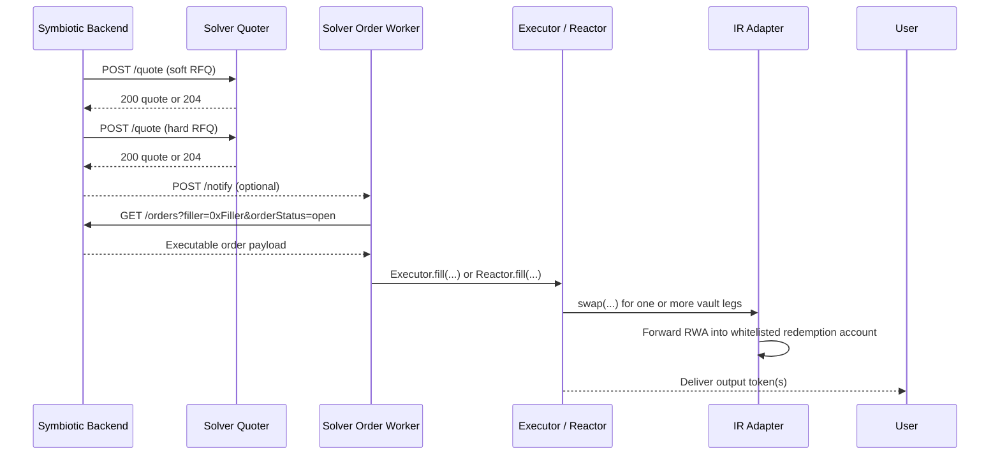

# Integrate As a Solver

This guide is for fillers and market makers that want to quote and execute Symbiotic instant-redemption orderflow.

Your job is simple to describe and hard to do well: price curator-gated instant-redemption flow, decide whether the discount is worth taking (optionally), and deliver the signed outputs onchain when you win. Symbiotic handles user signatures, order creation, and winner binding. You own pricing, execution, and last-mile risk checks.

## Why solvers plug in here

- You get access to permissioned RWA redemption flow without taking issuer-facing RWA custody.
- You can monetize spread, downstream routing, or external hedging around the orderflow.
- Vault inventory is suggested, not hard-routed. You choose the final execution plan.
- One market maker can delegate execution to multiple fillers.
- Some curators may choose not to run a solver at all and instead publish signed discounts that external solvers can execute against.
- `Executor.sol` in this repo is only a reference path, not a protocol requirement.

## Solver flow




## 1. Get onboarded as an eligible solver

Before you can win orderflow, you need:

- a solver `endpointUrl` that serves `POST /quote`
- an optional `notifyUrl` that serves `POST /notify`
- an onchain filler or executor address that will call `Reactor.fill(...)` or your own wrapper

There are two independent allowlists:

- The backend must know your solver record and endpoint.
- (optional) The curators must accept your filler address for the vaults you want to use.

On the adapter side, a caller is eligible when it is:

- the curator
- the curator-set market maker for that vault
- a delegated filler authorized by that market maker via `setFiller(vault, filler, true)`

Protect both `/quote` and `/notify` with `x-rfq-shared-secret`. The checked-in filler service does exactly that.

### Some flow may come with curator-signed pricing

Not every curator will want to operate a solver stack.

In that model:

- the curator signs a discount for a bounded duration
- external solvers use that signed discount to execute orderflow
- the Symbiotic backend adds a short-lived protocol cosign before handing that discount to solvers


## 2. Implement `POST /quote`

This is the endpoint the backend calls during both soft quoting and hard execution quoting.

Request:

```json
{
  "requestId": "uuid",
  "tokenInChainId": 1,
  "tokenOutChainId": 1,
  "swapper": "0x0000000000000000000000000000000000000000",
  "tokenIn": "0xACRED",
  "tokenOut": "0xUSDC",
  "amount": "100000000",
  "type": "EXACT_INPUT",
  "protocol": "v1",
  "numOutputs": 1,
  "quoteId": "uuid",
  "vaults": [
    {
      "vault": "0xVaultA",
      "collateral": "0xUSDC",
      "collateralDecimals": 6,
      "maxCollateralOut": "50000000",
      "maxRate": "997500000000000000"
    }
  ]
}
```

Quote response:

```json
{
  "chainId": 1,
  "amountIn": "100000000",
  "amountOut": "99750000",
  "filler": "0xYourExecutor",
  "requestId": "uuid",
  "swapper": "0x0000000000000000000000000000000000000000",
  "tokenIn": "0xACRED",
  "tokenOut": "0xUSDC",
  "quoteId": "uuid"
}
```

Rules that matter:

- Respond within the backend timeout window. The current stack is designed around a `1000ms` SLA.
- Return `204 No Content` when you do not want the order.
- Echo the request identifiers back exactly.
- In the current runtime, `swapper` is zeroed in backend-to-solver quote requests. Treat it as opaque and echo it unchanged.
- `vaults` is an inventory hint, not a prescribed route. You choose the final vault split.
- `maxRate` already includes the curator-enforced minimum discount.
- `maxCollateralOut` is authoritative headroom at quote time, not a promise that state will remain unchanged by fill time.

The reference filler in this repo is intentionally narrow:

- it only quotes when vault collateral already matches the requested `tokenOut`
- it does not perform second-leg routing

Those are sample implementation choices, not protocol constraints.

## 3. Learn when you won

You have two ways to discover a winning order.

### Option A: `POST /notify`

The current runtime webhook payload looks like this:

```json
{
  "orderHash": "0x...",
  "createdAt": 1712345700,
  "notifiedAt": 1712345701,
  "signature": "0xProtocolOrderSignature",
  "orderStatus": "open",
  "encodedOrder": "0xAbiEncodedOrder",
  "chainId": 1,
  "filler": "0xYourExecutor",
  "quoteId": "uuid",
  "offerer": "0xUser",
  "type": "Priority"
}
```

Treat `/notify` as a wake-up signal, not your only source of truth. If it is delayed or dropped, polling still works.

### Option B: poll `GET /orders`

Recommended poll:

```text
GET /orders?filler=0xYourExecutor&orderStatus=open&limit=20
```

Why this matters:

- the filler-scoped open view is the canonical executable surface
- that view includes `encodedOrder`, `signature`, `deadline`, and `filler`
- those fields are intentionally not exposed on the public order view

For a single order lookup:

```text
GET /orders?orderId=<uuid>&filler=0xYourExecutor&orderStatus=open
```

## 4. Build and submit the fill transaction

When you have an executable order:

1. Decode `encodedOrder` as the ABI-encoded `IReactor.Order`.
2. Verify your onchain caller equals `Order.filler`.
3. Build one or more `SwapInput` legs whose `amountIn` sums to `order.request.amountIn`.
4. Ensure every leg uses the same `tokenIn` as the order.
5. Submit through your own executor contract or call `Reactor.fill(...)` directly.

`encodedOrder` is not a custom opaque payload. It is the ABI encoding of:

```solidity
struct Order {
  Request request;
  bytes swapperSignature;
  address swapper;
  address filler;
}
```

The reference filler decodes it with `viem` like this:

```ts
import { decodeAbiParameters, parseAbiParameters } from "viem";

const reactorOrderEncodingParameters = parseAbiParameters(
  "((address tokenIn,uint256 amountIn,(address token,uint256 amount,address recipient)[] outputs,uint256 deadline,uint256 nonce,address protocol) request,bytes swapperSignature,address swapper,address filler)",
);

const [order] = decodeAbiParameters(reactorOrderEncodingParameters, encodedOrder);
```

If you are using code from this repo, `rfq/filler/src/lib/reactor.ts` already exposes `decodeOrder(encodedOrder)` and uses the same parameter layout the backend uses when it builds the order.

The reference path in this repo looks like this:

- your caller invokes `Executor.fill(...)`
- `Executor` forwards into `Reactor.fill(...)`
- `Reactor` validates the protocol signature and filler binding
- `Reactor` pulls the user's RWA through Permit2
- `Reactor` hands execution control back to your executor
- your executor calls `IRAdapter.swap(...)` for each vault leg
- `Reactor` finalizes output delivery to the signed recipients

Revalidate right before submission:

- `isPaused(vault)` is still `false`
- `getMaxAssets(vault)` still covers your planned collateral draw
- your vault split still respects `getMaxRate(vault, tokenToRedeem)`
- your collateral plus downstream routing still covers the signed outputs

The reference execution worker in `rfq/filler` performs those checks before submission.

## 5. Decide where your edge comes from

Common solver models:

- Direct-collateral filler: quote only when `collateral == tokenOut`.
- Routing filler: draw vault collateral, then trade elsewhere to satisfy the signed output token.
- Inventory or hedging filler: use the orderflow as a source or sink leg for an external book.

In every model, the RWA custody path stays the same:

- `Reactor` moves the user's RWA into the adapter.
- The adapter forwards that RWA to the deterministic `RedemptionAccount`.
- The solver does not need to hold the permissioned RWA inventory in its own execution wallet.

## Production checklist

- Treat `/notify` as best-effort delivery and keep polling `GET /orders`.
- The public order surface is intentionally coarse: `open`, `filled`, `expired`, `error`, `cancelled`, `unverified`, `insufficient-funds`.
- `GET /orders` is currently unauthenticated. Executable extras are gated by the `filler` filter rather than a separate auth layer.
- Notify payloads are keyed around `orderHash`, while public retrieval often starts from `orderId`. Resolve across the API if you need both.
- `Executor.sol` is an example, not a protocol requirement.
- Delegated execution authority lives at the adapter through the market-maker and filler relationship, not in the backend alone.
