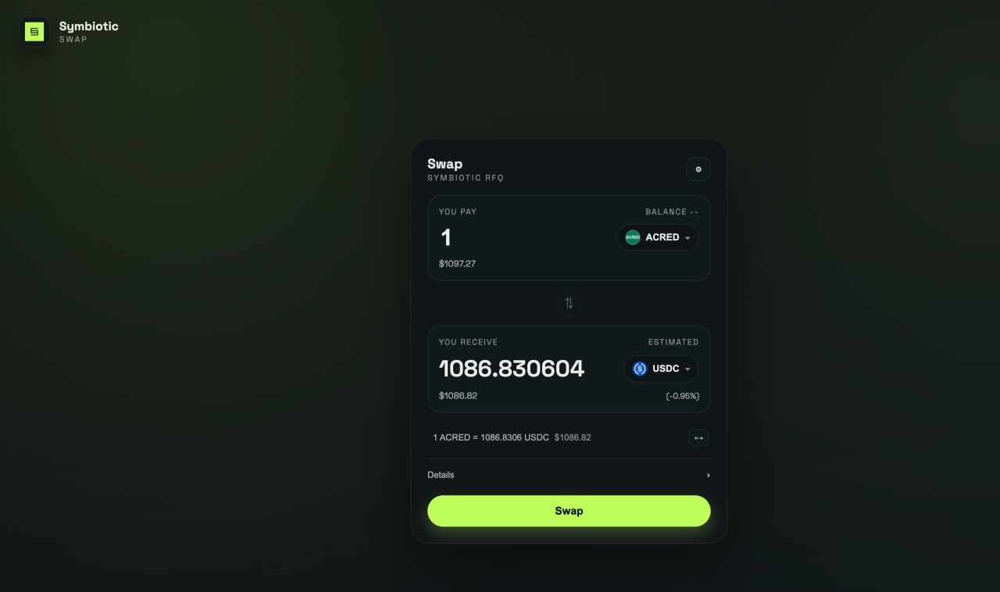

# Contents

1. [Problem statement](#problem-statement)
2. [System components](#system-components)
   - [Core V2 — Vault infrastructure](#symbiotic-core-v2--vault-infrastructure)
   - [RWA Instant Redemptions Adapter](#rwa-instant-redemptions-adapter)
   - [Swap Engine](#swap-engine)
3. [User flows](#user-flows)
   - [Swapper flow](#swapper-flow)
   - [Market maker flow](#market-maker-solver-flow)
   - [Curator flow](#curator-flow)
4. [Specification](#specification)
   - [Design principles](#design-principles)
   - [Components](#components)
   - [Signing model](#signing-model)
   - [API design](#api-design)
   - [Quote orchestration](#quote-orchestration)
   - [Smart contract behavior](#smart-contract-behavior)
   - [Status and indexing](#status-and-indexing)
   - [Safeguards](#safeguards)
   - [Assumptions to verify early](#assumptions-to-verify-early)

---

# Problem statement

Users hold RWA tokens (e.g. ACRED) outside of Symbiotic. Official issuer redemptions are asynchronous and can take days or months. Users who want to exit their RWA positions need a way to receive a liquid token (e.g. USDC) immediately, without waiting for the issuer redemption cycle.

Separately, Symbiotic vaults hold liquid collateral (e.g. aUSD, USDC) that is either allocated as virtual stake to Apps or deployed to DeFi protocols (Morpho, Aave) for yield. This idle or recallable collateral can be used to fund instant redemptions — the vault fronts liquid assets to the user in exchange for the RWA token, which is then sent for official issuer redemption. The vault waits for the redeemed assets to come back from the issuer instead of the user, while earning a premium by buying the RWA token at a discount.

The system must:

- Let users swap any supported RWA token to a liquid output token in seconds, not days.
- Use vault collateral to fund the instant payout, with the vault absorbing the redemption wait time.
- Avoid requiring solvers/market-makers to custody the permissioned RWA token.
- Ensure vault risk is bounded and curator-controlled.
- Maintain compliance boundaries — RWA tokens flow only to issuer-whitelisted addresses.
- Cleanly account for asynchronous redeemed assets that arrive later and reconcile them back into the vault.

---

# System components

## Symbiotic Core V2 — Vault infrastructure

Vaults hold liquid collateral (e.g. aUSD, USDC) and can deploy it across multiple adapters.

- **Virtual stake allocations** — vaults allocate stake to Apps (operators, services) with virtual guarantees, without moving real funds.
- **Passive yield adapters** — real funds can be deployed to Morpho, Aave, or similar protocols for yield while idle.
- **On-demand adapters** — adapters that can recall liquidity from passive sources when needed (e.g., RWA Instant Redemptions Adapter).

The vault's idle or recallable collateral is what funds the instant payout to users. In return, the vault receives the user's RWA token (sent to a whitelisted redemption account), and later receives the redeemed assets.

## RWA Instant Redemptions Adapter

A purpose-built adapter that bridges the gap between instant user payouts and asynchronous issuer redemptions:

- Releases vault collateral to fund the instant payout to the user.
- Records receivable exposure in RWA-specific manner — the vault is now owed the future redeemed assets.
- Enforces an oracle-derived exchange rate with curator-set `minDiscount`. Total outstanding is bounded by the vault's allocation limit, and each `(vault, tokenToRedeem)` may also have a curator-set outstanding cap.
- Later reconciles when redeemed assets arrive, converts them back into vault collateral, and distributes rewards if enough redeemed assets arrived.
- Also supports direct acquisition: curator or market maker collateral can fund part of a swap, and the corresponding RWA inventory stays claimable instead of being sent for issuer redemption.

### Market maker authorization

The adapter keeps one curator-set market maker per vault. That market maker may then manage filler authorization through `isFiller[marketMaker][filler]`. Two paths:

1. **Direct call** — the curator, the configured market maker, or one of that market maker's fillers calls the adapter directly as `msg.sender`.
2. **Signed call** — a signed `SignedSwap` is consumed with `SignedSwap.caller == msg.sender`; the recovered `SignedSwap.signer` must be either the curator, the configured market maker, or one of that market maker's fillers.

The curator may also pause a vault's instant-redemption path. When paused, `_swap(...)` reverts for that vault until the curator clears the pause.

### Direct acquisition

The adapter also supports a direct-acquisition path for curator / market-maker capital:

- curator and the configured market maker may pre-fund collateral into the adapter,
- during `swap(...)`, the adapter consumes those balances before allocating additional vault collateral,
- the matching share of `tokenToRedeem` inventory is kept in the `RedemptionAccount` instead of being redeemed to the issuer,
- later, the curator or market maker claims that reserved inventory via `claimAcquired(...)`.

### RedemptionAccount

Each issuer-facing redemption path gets a deterministic **RedemptionAccount** that is whitelisted by the RWA issuer. A vault therefore uses one or more redemption accounts, typically keyed by `(vault, tokenToRedeem)` via CREATE2.

- Receives the RWA token from users during swaps.
- Forwards that RWA token to the issuer redemption destination.
- Owns issuer-specific submission mechanics; for example, `ACREDAccount` can hardcode its redemption wallet immutably, while other account types may implement different flows.
- Later receives redeemed assets or redemption tokens and exposes permissionless `convertRedemption(...)` to initiate conversion back into vault collateral when needed.

## Swap Engine

The user-facing product that orchestrates instant redemptions through competitive solving.

### UI



- User enters RWA amount, sees a quote, signs one Permit2 witness order.
- Polls backend for order status.
- Shows simple lifecycle: quoted → signing → pending → filled / expired / failed.

### Backend (quotes & auctions)

- Runs a two-phase RFQ: soft quote (pre-signature, indicative) → hard quote (post-signature, binding).
- Fans out to permissioned solvers with 1000ms SLA.
- Selects winner, executes safeguards (e.g., approval, balance, and quote-validity checks), then issues the protocol cosign.
- Runs an indexer for canonical state, receivable lifecycle tracking, and curator visibility.

### Reactor (on-chain)

- **Reactor** — dedicated contract that validates the signed order, pulls the user's RWA via Permit2, transfers each RWA leg into the IR Adapter, and then calls back into the calling fill address via `execute(order, swaps, executorData)`.
- **Permit2** — user signs one `permitWitnessTransferFrom` per trade; one-time token approval to Permit2.
- **RWA IR Adapter** — during `swap(...)`, the adapter forwards `tokenToRedeem` into the deterministic `RedemptionAccount` so the RWA token always lands in the whitelisted issuer-facing account.

---

# User flows

## Swapper flow

1. User selects the RWA token and amount (e.g. 100 ACRED) and their desired output token (e.g. USDC).
2. UI requests a soft quote from the backend (1000ms).
3. User sees the quoted output amount and confirms.
4. If first time: user approves the RWA token to Permit2 (one-time per token).
5. User signs a single Permit2 witness order covering token pair, amounts, min output (including the slippage), deadline, and reactor address.
6. UI submits the signed order via `POST /order`.
7. Backend runs a hard RFQ auction (pushes `/quote` to solvers), selects winner, and optionally sends `/notify` to the winner.
8. Solver submits the fill transaction on-chain.
9. User receives the output token. The RWA token goes directly to the whitelisted redemption account (solver never custodies it).
10. UI shows filled status.

## Market maker (solver) flow

1. Register solver identity and provide a quote endpoint URL through the Symbiotic team.
2. Receive backend-initiated `/quote` requests with order details and vault(s) context.
3. Query `getMaxAssets(vault)` on IR Adapter to see available liquidity and `getMaxRate(vault, tokenToRedeem)` for maximum rate.
4. Compute a route: vault(s) collateral(s) → additional liquidity sources → output token to user.
5. Return a quote (200) or a zero-valued no-quote response (200 with `amountOut = 0`).
6. If selected as winner: receive `/notify` or observe the same order via `GET /orders`, with the executable order payload.
7. Build and submit the reactor `fill(...)` transaction.
8. Solver receives vault collateral (collateral), routes it through additional liquidity sources if needed to deliver the output token to the user.
9. Solver never touches the RWA token — Reactor sends it directly to the redemption account.

## Curator flow

1. Deploy a vault with a chosen collateral.
2. Call `getAccount(vault, tokenToRedeem)` to get the deterministic redemption account address and make it whitelisted by the issuer.
3. Configure allowed recallable liquidity sources (Morpho, Aave, etc.).
4. Set risk parameters: maximum allocation to InstantRedemptionAdapter, minimum discount from oracle price (`1e6` precision), and whether the vault's path is paused.
5. Monitor receivables dashboard via Curator UI — track open RWA redemption requests, expected redemption deadlines, arrival of redeemed assets, and conversion status.

---

# Specification

Detailed design for each RWA instant redemptions component follows below.

---

## Design principles

- **Private two-phase RFQ** — UniswapX-style hard RFQ for winner-takes-exclusivity execution.
- **Permit2 `permitWitnessTransferFrom`** — single user signature per trade, one-time token approval.
- **Reactor contract** — own ABI, coordinates the Permit2 pull, transfer of RWA into the IR Adapter, and fill callback invocation. Enforces per-order filler exclusivity while keeping downstream routing filler-controlled.
- **RWA IR Adapter** — releases vault liquidity, records receivables, enforces curator-managed MM allowlist. Total outstanding is bounded by the vault allocation limit, with an optional curator-set per-RWA outstanding cap.
- **RedemptionAccount** — one or more deterministic issuer-whitelisted addresses, typically per `(vault, tokenToRedeem)`.
- **No solver custody of RWA token** — the user RWA is pulled by Reactor, routed through the IR Adapter, and forwarded into the whitelisted redemption account in the same execution flow.

## Non-goals for v1

- Cross-chain output settlement.
- Partial fills.
- Public Dutch auction fallback.
- Generic permissionless solver competition.

---

## Components

### Off-chain

1. **Symbiotic UI**
   - requests quotes,
   - collects user signature,
   - polls order status.
2. **Symbiotic Backend**
   - quote/orchestration service,
   - solver fanout,
   - winner selection,
   - processing safeguards,
   - signer service integration,
   - status API.
3. **Solver Gateway**
   - `/quote`, optional `/notify`.
4. **Risk Engine**
   - issuer eligibility,
   - vault liquidity checks,
   - oracle freshness,
   - curator policy checks,
   - solver health / fade scoring,
   - pre-trade validity checks.
5. **Indexer / Status Service**
   - watches protocol contracts,
   - persists state,
   - exposes backend-readable status and curator ops state.

### On-chain

1. **Permit2**
   - one-time token approval to Permit2,
   - per-trade `permitWitnessTransferFrom` signature.
2. **Reactor**
   - own ABI, coordinates Permit2, transfer of RWA into the IR Adapter, and fill callback invocation,
   - pulls RWA token (e.g. ACRED) from user, transfers each RWA leg into `IRAdapter`, then completes signed output delivery itself,
   - enforces filler exclusivity via protocol-signed `Order.filler`, where `filler` is the authorized onchain fill address.
3. **RWA IR Adapter**
   - releases vault collateral (e.g. aUSD),
   - can recall from allowed liquidity sources,
   - records receivable,
   - enforces rate and outstanding caps (bounded by vault allocation limit and optional curator-set per-RWA limits),
   - enforces curator-managed MM allowlist (msg.sender or delegated signature).

---

## Signing model

Three independent authorizations are involved:

1. **User (swapper)** signs the trade bounds once through Permit2.
2. **Backend (protocol)** selects the winning filler, binds its authorized onchain fill address into `Order.filler`, and sets the protocol signer in `Request.protocol`.
3. **Solver (market maker)** optionally signs per-vault adapter legs that are consumed after Reactor deposits RWA into the relevant redemption account(s).

This split keeps user consent simple, keeps vault selection under solver control, and lets the adapter stay logically independent from Reactor and the off-chain engine.

### Swapper signature

Domain: Permit2

Use **Permit2 SignatureTransfer**, specifically `permitWitnessTransferFrom`.
The user does **one** trade signature per redemption.
The user still needs the **one-time token approval to Permit2** first.

```solidity
struct Output {
    address token;
    uint256 amount;
    address recipient;
}

struct Request {
    address tokenIn;          // e.g. ACRED
    uint256 amountIn;         // exact input
    Output[] outputs;         // output obligations (user payout + optional integrator fees)
    uint256 deadline;
    uint256 nonce;            // random, generated by Backend, used by Permit2
    address protocol;         // protocol signer bound to this request
}
```

The `outputs` array replaces explicit referrer fields. Integrator fees are just additional outputs:

- `outputs[0]`: 99.7 USDC → user
- `outputs[1]`: 0.3 USDC → integrator (optional)

The user sees and signs all outputs. In practice these are minimum obligations, not a routing prescription: the filler must make those outputs collectible by Reactor, and Reactor must complete every `(token, amount, recipient)` transfer before the fill completes.

### Signed by Protocol

Domain: Reactor

```solidity
struct Order {
    Request request;
    bytes swapperSignature;
    address swapper;
    address filler;    // winning filler's authorized onchain fill address
}
```

### Signed by Market Maker

Domain: RWA IR Adapter

Should be signed per vault leg and use adapter-local replay protection.

```solidity
struct Swap {
    address recipient;
    address vault;
    address tokenIn;
    uint256 amountOut;
}

struct SignedSwap {
    address recipient;
    address vault;
    address tokenIn;
    uint256 amountOut;
    address caller;
    address signer;
    uint256 nonce;
    uint256 deadline;
}

struct SwapInput {
    uint256 amountIn;
    Swap swap;
}
```

The adapter should consume each signed `nonce` at most once per `(vault, tokenToRedeem)`. In the signed path `SignedSwap.caller` must equal `msg.sender`, while the recovered `SignedSwap.signer` must already be the vault curator, the configured market maker, or one of that market maker's fillers. If the caller uses the direct path, the signature can be skipped and the same fields are supplied through `Swap`. Curators may also pause a vault, which blocks any `_swap(...)` execution for that vault.

### Authorization layers

Three separate authorization concerns:

1. **Reactor** — enforces that only the filler address bound in `Order.filler` can execute a specific order and satisfy the signed user outputs.
2. **Executor / filler contract** — if used, enforces which callers are allowed to trigger that fill contract.
3. **IR Adapter** — enforces which callers are allowed to draw liquidity from the vault and where each authorized draw sends collateral. The curator sets one market maker per vault, that market maker manages `isFiller[marketMaker][filler]` for delegated solver access, the curator may call directly or sign delegated swaps, and the curator may pause the vault's adapter path entirely.

---

## API design

Expose a custom swapper-facing API for the Symbiotic RFQ flow and align the solver-facing side with the documented UniswapX parameterization request/response shape, extended with Symbiotic vault inventory data.

### Conventions

- Native ETH is represented by Reactor's `NATIVE` sentinel (`0x0000000000000000000000000000000000000000`) and is only supported as an output token in v1.
- `minDiscount` is parts-per-million precision, where `1_000_000 = 100%`.

### Swapper-facing API

#### Primary surface

- `POST /check_approval`
- `POST /quote`
- `POST /order`
- `GET /orders`

#### `POST /check_approval`

Purpose: mirror Uniswap's Permit2 approval bootstrap flow so the UI can determine whether the wallet still needs a one-time token approval before it can sign and submit an order.

Request:

```json
{
  "walletAddress": "0xUser",
  "chainId": 1,
  "token": "0xACRED",
  "amount": "100000000"
}
```

Response:

```json
{
  "requestId": "uuid",
  "approval": null,
  "cancel": null
}
```

Rules:

- if approval is needed, return a fully formed transaction payload in `approval`,
- `cancel` is only needed for non-standard ERC-20 approval-reset patterns; otherwise return `null`,
- if an integrator skips this route, they must reproduce the same approval detection logic client-side.

#### `POST /quote`

Purpose: return an indicative quote using Uniswap Trading API naming, plus the Permit2 witness payload the user will sign if they proceed.

Request:

```json
{
  "tokenInChainId": 1,
  "tokenOutChainId": 1,
  "tokenIn": "0xACRED",
  "tokenOut": "0x0000000000000000000000000000000000000000",
  "type": "EXACT_INPUT",
  "amount": "100000000",
  "swapper": "0xUser",
  "slippageTolerance": 0.5,
  "routingPreference": "BEST_PRICE",
  "permitAmount": "EXACT",
  "outputs": [
    { "token": "0x0000000000000000000000000000000000000000", "recipient": "0xUser" },
    { "token": "0x0000000000000000000000000000000000000000", "recipient": "0xReferrer", "portionBps": 10 }
  ]
}
```

Response:

```json
{
  "requestId": "uuid",
  "routing": "PRIORITY",
  "quote": {
    "quoteId": "uuid",
    "slippageTolerance": 0.5,
    "aggregatedOutputs": [{ "token": "0x0000000000000000000000000000000000000000", "amount": "53000000000000000" }],
    "orderInfo": {
      "tokenIn": "0xACRED",
      "amountIn": "100000000",
      "outputs": [
        { "token": "0x0000000000000000000000000000000000000000", "amount": "52950000000000000", "recipient": "0xUser" },
        { "token": "0x0000000000000000000000000000000000000000", "amount": "50000000000000", "recipient": "0xReferrer" }
      ],
      "deadline": 1712345700,
      "nonce": "0x..."
    }
  },
  "permitData": {
    "domain": { "...": "..." },
    "types": { "...": "..." },
    "value": { "...": "..." }
  }
}
```

Rules:

- base request field names should stay close to Uniswap Trading API naming: `tokenInChainId`, `tokenOutChainId`, `tokenIn`, `tokenOut`, `amount`, `type`, `swapper`, `slippageTolerance`, `routingPreference`,
- response shape should follow Uniswap's top-level names: `requestId`, `quote`, `routing`, `permitData`,
- if native ETH is used as the output token, represent it with Reactor's `NATIVE` sentinel (`0x0000000000000000000000000000000000000000`),
- `quote.orderInfo.outputs` are the minimum output obligations that Reactor later enforces,
- soft quote deadline: **1000ms hard cap**,
- if no valid quote exists: `404 Not Found` with a normal JSON error body,
- if input is malformed or unsupported: `4xx` with a normal JSON error body.

#### `POST /order`

Purpose: submit the signed swapper request for hard RFQ and execution.

Request:

```json
{
  "quote": { "...": "..." },
  "signature": "0xPermit2WitnessSig"
}
```

Response:

```json
{
  "requestId": "uuid",
  "orderId": "uuid",
  "orderStatus": "open"
}
```

Rules:

- repeated submissions for the same quote should dedupe on `quote.quoteId` after signature validation,
- the backend reruns the auction against the signed quote and only then selects a winner,
- `orderId` is the canonical public identifier for the submitted order,
- if the quote expired or the order cannot be honored anymore, return `409` rather than silently re-quoting.

#### `GET /orders`

Purpose: retrieve orders.

Query params:

- `orderType`
- `limit`
- `cursor`
- `orderStatus`
- `orderId`
- `orderIds`
- `swapper`
- `filler`
- `sortKey`
- `sort`

The request should require at least one of `orderId`, `orderIds`, `orderStatus`, `swapper`, or `filler`, matching Uniswap's documented behavior.

Response shape should stay close to Uniswap's public `GET /orders` response:

```json
{
  "requestId": "uuid",
  "orders": [
    {
      "type": "PRIORITY",
      "orderId": "uuid",
      "orderStatus": "open",
      "quoteId": "uuid",
      "swapper": "0xUser",
      "txHash": null,
      "nonce": "0x...",
      "input": {
        "token": "0xACRED",
        "amount": "100000000"
      },
      "outputs": [
        { "token": "0xUSDC", "amount": "99700000", "recipient": "0xUser" },
        { "token": "0xUSDC", "amount": "50000", "recipient": "0xReferrer" }
      ],
      "settledAmounts": []
    }
  ],
  "cursor": "opaque-cursor"
}
```

Rules:

- canonical single-order lookup is `GET /orders?orderId=...`,
- the same endpoint serves both swapper and filler views; filters such as `swapper` and `filler` select the relevant slice,
- recommended solver poll is `GET /orders?filler=0xFiller&orderStatus=open&limit=20`,
- public `orderStatus` should stay close to Uniswap's surface (`open | expired | error | cancelled | filled | unverified | insufficient-funds`), while more granular backend pipeline states stay internal,
- when returned to the winning filler, the order payload should additionally include `encodedOrder`, `signature`, `quoteId`, `input`, `outputs`, and `deadline`.

### Solver-facing API

This surface is split by direction:

- solver-hosted endpoints called by the Symbiotic backend: `POST /quote`, optional `POST /notify`
- backend-hosted endpoint polled by the solver: `GET /orders?filler=...&orderStatus=open`

Primary naming should follow documented UniswapX RFQ conventions:

- `POST /quote`
- `GET /orders?filler=...&orderStatus=open`
- optional `POST /notify` webhook for winners

#### `POST /quote` (backend -> solver RFQ endpoint, UniswapX-compatible)

The solver hosts this endpoint. The Symbiotic backend calls it during soft and hard RFQ. Use Uniswap's documented quoter request and response names as the base schema, then append Symbiotic-specific vault inventory data.

Request:

```json
{
  "requestId": "uuid",
  "tokenInChainId": 1,
  "tokenOutChainId": 1,
  "swapper": "0x0000000000000000000000000000000000000000",
  "tokenIn": "0xACRED",
  "tokenOut": "0xUSDC",
  "amount": "100000000",
  "type": "EXACT_INPUT",
  "protocol": "v1",
  "numOutputs": 2,
  "quoteId": "uuid",
  "vaults": [
    {
      "vault": "0xVaultA",
      "collateral": "0xaUSD",
      "collateralDecimals": 18,
      "maxCollateralOut": "500000000",
      "maxRate": "..."
    },
    {
      "vault": "0xVaultB",
      "collateral": "0xUSDC",
      "collateralDecimals": 6,
      "maxCollateralOut": "300000000",
      "maxRate": "..."
    }
  ]
}
```

Response 200 (quoting):

```json
{
  "chainId": 1,
  "amountIn": "100000000",
  "amountOut": "99750000",
  "filler": "0xFiller",
  "requestId": "uuid",
  "swapper": "0xUser",
  "tokenIn": "0xACRED",
  "tokenOut": "0xUSDC",
  "quoteId": "uuid"
}
```

Rules:

- respond within **1000ms**,
- if no quote is available, return `204 No Content`,
- `swapper` is zeroed in RFQ requests, matching Uniswap's documented quoter schema,
- base field names and response names should stay aligned with Uniswap (`amount`, `type`, `quoteId`, `filler`, `requestId`),
- if native ETH is used as the output token, represent it with Reactor's `NATIVE` sentinel (`0x0000000000000000000000000000000000000000`),
- `vaults` is the Symbiotic-specific extension,
- each vault entry exposes the adapter-authoritative conservative `maxRate` together with `collateralDecimals`; solvers should use those values directly instead of re-deriving discount math off-chain,
- the backend exposes vault inventory only; it must not prescribe the final vault split, and the winning solver chooses the final Reactor-side `SwapInput[]` during execution.

If the solver is disabled by the circuit breaker, the same quote endpoint may receive a lightweight cooldown payload, matching Uniswap's documented pattern:

```json
{
  "blockUntilTimestamp": 1712345700
}
```

For winner discovery and order retrieval, solvers use the same `GET /orders` endpoint defined above, typically with `filler=...` and `orderStatus=open`.

#### `POST /notify` (optional webhook)

Purpose: lower-latency order delivery than polling. This should mirror Uniswap's documented webhook notification shape as closely as possible, with only the minimum Symbiotic-specific additions needed for execution.

Request:

```json
{
  "orderId": "uuid",
  "createdAt": 1712345700,
  "signature": "0xPermit2WitnessSig",
  "orderStatus": "open",
  "encodedOrder": "0xAbiEncodedOrder",
  "chainId": 1,
  "filler": "0xFiller",
  "quoteId": "uuid",
  "offerer": "0xUser",
  "type": "PRIORITY"
}
```

Rules:

- keep this payload as close as possible to Uniswap's webhook notification fields: `createdAt`, `signature`, `orderStatus`, `encodedOrder`, `chainId`, optional `filler`, optional `quoteId`, optional `offerer`, optional `type`,
- `orderId` is our canonical public id for the order; if a contract-level hash is also needed internally, keep it out of the primary webhook schema,
- `encodedOrder` must carry the full executable order payload, including any protocol-side reactor authorization required to fill it,
- `orderStatus` should be `open` when the winner receives the notification, matching Uniswap's documented behavior.

Backend indexes on-chain Reactor events to update order status. Solvers track their own tx outcomes on-chain, but `GET /orders` remains the canonical public retrieval surface.

---

## Quote orchestration

### Soft quote

Algorithm:

- fanout to all eligible solvers,
- hard cap: **1000ms**,
- if `routingPreference = FASTEST`, return after the first valid quote,
- if `routingPreference = BEST_PRICE`, return the best valid quote collected before the 1000ms cap.

Use this for UI responsiveness.

### Hard quote

After user signature:

- rerun solver fanout,
- hard cap: **1000ms**,
- use actual signed order bounds,
- verify the top candidate against the signed order bounds and the backend-visible risk / liquidity checks,
- pick the winner,
- protocol signs `Order` (binding filler),
- if webhook delivery is enabled, call `/notify` to the winner.

This should be treated as the binding auction.

### Winner scoring

Primary sort key: highest guaranteed `amountOut` to the user.

---

## Smart contract behavior

### Reactor

Own ABI tailored to the RWA instant redemption flow. Reactor always enforces the Permit2 pull and transfers each RWA leg into the IR Adapter. In practice, the winning filler uses an authorized onchain fill address to call Reactor. Reactor requires `Order.filler == msg.sender` and then calls back into `execute(order, swaps, executorData)` on `msg.sender`.

For output settlement, native ETH is denoted by the Reactor `NATIVE` sentinel (`0x0000000000000000000000000000000000000000`).

Reactor fill endpoints:

- `fill(Order order, bytes protocolSignature, SwapInput swapInput, bytes executorData)` - called by the filler's authorized onchain fill address; Reactor treats `msg.sender` as the execution target
- `fill(Order order, bytes protocolSignature, SwapInput[] swapInputs, bytes executorData)` - same as above, but for multi-leg fills across multiple vault legs

Executor fill endpoints:

- `fill(Order order, bytes protocolSignature, SwapInput swapInput, bytes executorData)` - optional role-gated filler entrypoint that forwards into Reactor
- `fill(Order order, bytes protocolSignature, SwapInput[] swapInputs, bytes executorData)` - optional role-gated filler entrypoint for multi-leg fills

Executor callback:

- `execute(Order order, Swap[] swaps, bytes executorData)` - called by Reactor on `msg.sender` after the RWA leg has been transferred into the IR Adapter

Execution order:

1. Authorized caller calls `Executor.fill(...)`
2. Executor verifies the caller role
3. Executor calls `Reactor.fill(...)`
4. Reactor verifies the protocol signature on `Order` against `Order.request.protocol` and checks `Order.filler == msg.sender`
5. Reactor pulls RWA token (e.g. ACRED) from user via Permit2 `permitWitnessTransferFrom` with `Request` as witness
6. Reactor verifies `sum(swapInputs[*].amountIn) == Order.request.amountIn`, checks every `swapInputs[*].swap.tokenIn == Order.request.tokenIn`, and transfers each RWA leg directly to `IRAdapter`
7. Reactor calls `execute(order, swaps, executorData)` on `msg.sender`, where `swaps[i] = swapInputs[i].swap`
8. The filler's onchain fill address calls `IRAdapter.swap(Swap)` for each `swaps[i]`; inside that call the adapter forwards `tokenToRedeem` into `IRAdapter.getAccount(vault, tokenToRedeem)`, records the vault-funded portion, and submits any non-acquired inventory for issuer redemption. The filler then performs downstream routing, approves any ERC-20 output token to Reactor only if its current allowance is not already `uint256.max`, and finally flushes any leftover native ETH to Reactor
9. Reactor completes delivery itself by `transferFrom(msg.sender, recipient, amount)` for ERC-20 outputs; for `NATIVE` outputs it forwards the ETH that the filler flushed back to Reactor

The Reactor enforces the protocol signature on `Order` against `Order.request.protocol`, requires `Order.filler` to equal the calling fill address, and uses `msg.sender` as the execution callback target. If a dedicated filler contract is used, caller authorization is handled there. Reactor supports the direct-caller adapter path through either a single `SwapInput` or multi-leg `SwapInput[]`, and its callback passes the corresponding `Swap[]`. Separately, the IR Adapter still supports a signed `SignedSwap` path, but that path is adapter-side only, bound to `SignedSwap.caller == msg.sender` and signer-authorized through `SignedSwap.signer`, and not exposed through the Reactor ABI. Reactor does not verify recipient balance deltas anymore; instead, it finalizes by pulling approved ERC-20 outputs from `msg.sender` and sending them to the signed recipients, while `NATIVE` outputs are paid from ETH flushed back by the filler.

The Adapter's liquidity is solver-exclusive to the curator-set market maker and that market maker's fillers, while the curator retains a direct and signed override:

- Symbiotic Engine - Reactor still enforces filler exclusivity on-chain through `Order.filler == msg.sender`
- UniswapX - supported, since the adapter caller can be the filler's own authorized onchain address
- Adapter-side signed swap path - supported only on the Adapter's signed-swap path, not via the Reactor ABI; the signed leg is still caller-bound through `SignedSwap.caller == msg.sender` and signer-authorized through `SignedSwap.signer`

### Critical invariant

In all supported paths, **solver never custodies the RWA token**.

Reactor pulls the RWA token from the user and routes it into the IR Adapter, and the adapter immediately forwards the relevant leg into the vault's RedemptionAccount during `swap(...)`.

## RWA IR Adapter

Main responsibilities:

1. verify adapter caller authorization (`msg.sender` in the direct path must be curator, market maker, or market-maker filler; in the signed path `caller == msg.sender` and `signer` must be curator, market maker, or market-maker filler),
2. verify the vault is not paused by its curator,
3. verify the adapter currently holds the expected `tokenToRedeem` amount for the requested leg,
4. compute conservative lendable amount,
5. recall liquidity from allowed sources if needed,
6. release vault collateral to the solver's chosen recipient,
7. forward `tokenToRedeem` into the `RedemptionAccount` and create a redemption request for any non-acquired inventory,
8. later reconcile redeemed assets,
9. convert redeemed assets back to vault collateral.

### Funding formula

For a given `rwaAmount`, compute:

```
oracleRate = rwaUsdPrice / collateralUsdPrice
conservativeRate = oracleRate * (1_000_000 - minDiscount) / 1_000_000
availableLiquidity = immediateLiquidity + recallableLiquidityFromAllowedSources

collateralOut = min(
  rwaAmount * conservativeRate,
  availableLiquidity,
  allocationHeadroom                    // vault allocation limit - total outstanding
  rwaHeadroom                           // per-RWA limit - outstanding(vault, tokenToRedeem), if configured
)
```

`allocationHeadroom` is the remaining capacity under the vault's allocation limit to this adapter. `rwaHeadroom` is the remaining capacity under the curator-set per-RWA cap for that `(vault, tokenToRedeem)`; if no cap is configured, it is treated as unbounded.

If any bound is zero: no quote / no execution.

### Oracle / NAV source

Each supported token must have a protocol-set USD oracle. Pair rates for both `(tokenToRedeem, collateralToken)` swap quoting and `(redemptionToken, collateralToken)` reconciliation are derived from two token/USD oracle reads.

```solidity
interface IOracle {
    function getPrice() external view returns (uint256 price);
}
```

Where:

- `price` is the token/USD rate in `1e18` precision.

For a pair `(tokenIn, tokenOut)`:

```text
pairRate = tokenInUsdPrice / tokenOutUsdPrice
```

Rules:

- oracles are token-scoped and USD-quoted,
- a missing oracle or a zero price pauses usage of every affected derived pair until the protocol restores the source.

### Recall semantics

Recallable liquidity is synchronous (is reallocated from multiple adapters and vault in the same transaction).

Rules:

- only curator-approved liquidity sources that can withdraw within the same transaction count as `recallableLiquidityFromAllowedSources`,
- sources with cooldowns, queue-based exits, or asynchronous withdrawals are not counted as recallable,
- quoting may treat recallable liquidity as available, but execution must recheck it on-chain,
- if any recall leg returns less than expected and leaves the vault below the requested collateral amount, the fill reverts.

### Receivable accounting

Receivable accounting is RWA-specific, not governed by one universal share/epoch model.

Rules:

- accounting is maintained per `(vault, tokenToRedeem)`,
- each supported RWA uses a protocol-selected `RedemptionAccount` implementation aligned to that issuer's redemption mechanics,
- accounting must be driven by explicit redemption submissions and actual converted redemption amounts, not by raw token balances,
- partial or delayed redeemed assets keep the relevant redemption requests open until more assets arrive or they are operationally closed,
- rewards exist only to the extent realized converted collateral exceeds the amount that must be restored for those redemption requests,
- the `RedemptionAccount` computes what is currently `deallocatable()` principal and `skimmable()` reward, while the IR Adapter only pulls those amounts later through `deallocate()`.

Examples:

- ACRED may group redemption requests by quarter aligned to the issuer repurchase schedule; redemptions submitted before a quarter's cutoff belong to that quarter's group, and claiming is expected to complete before the next quarter's redemption window.
- Midas non-instant redemptions may use a pro-rata fraction model over a single rolling pool per (vault, tokenToRedeem) tracking cumulative totalCostOutstanding and totalExpectedProceeds. When converted collateral arrives, cost is attributed pro-rata (costPortion = totalCostOutstanding × min(converted, totalExpectedProceeds) / totalExpectedProceeds), and the excess over attributed cost is recognized as reward after absorbing any prior accumulated losses. Midas tokens do not accrue yield during redemption, so expected proceeds closely predict actual converted collateral, and short settlement latency keeps the pool small.

### `convertRedemption(...)`

`convertRedemption(...)` is the permissionless reconciliation path from redeemed assets back into vault collateral.

The call is intentionally asynchronous from an accounting perspective. It only initiates or executes conversion of redeemed assets that are currently held by the `RedemptionAccount`. It does not itself realize principal or reward. That realization happens later when the adapter calls `deallocate()` on the account and pulls whatever collateral has actually arrived.

Each supported `(redemptionToken, collateralToken)` reconciliation path must have:

- a protocol-set conversion adapter,
- a protocol-set USD oracle for `redemptionToken`,
- a protocol-set USD oracle for `collateralToken`.

The protocol also configures reconciliation discounts on the adapter:

- `globalMaxConvertDiscount`: the default reconciliation max discount,
- `pairMaxConvertDiscount[redemptionToken][collateralToken]`: an optional pair-specific override.

Conversion adapters are the extension point for non-trivial reconciliation mechanics. The IR Adapter and `RedemptionAccount` stay generic; pair-specific behavior lives in isolated converter contracts when the path is not already the vault collateral. The adapter selects the `redemptionToken` and `collateralToken` for a given reconciliation call, and conversion output always settles back into the `RedemptionAccount` before any later deallocation. Examples:

- `redemptionToken == collateralToken`: no conversion call is needed; the collateral can remain on the account until `deallocate()`,
- USDC -> aUSD: use a native conversion adapter for that canonical issuer / wrapper path,
- USDC -> LBTC: use an external market conversion adapter, still bounded by the oracle-and-discount-derived minimum output.

Behavior:

1. Read the current balance of the selected redemption token held by the `RedemptionAccount`.
2. If the redemption token already matches the vault collateral, skip `convertRedemption(...)`; no conversion is required.
3. Otherwise, load the configured conversion adapter for that token pair.
4. Compute the oracle-bounded minimum collateral output from the two USD oracle reads and the configured reconciliation discount:

```text
oracleRate = redemptionTokenUsdPrice / collateralTokenUsdPrice
effectiveMaxDiscountPpm = pairMaxConvertDiscount != 0 ? pairMaxConvertDiscount : globalMaxConvertDiscount
oracleMinOut = redemptionAmount * oracleRate * (1_000_000 - effectiveMaxDiscountPpm) / 1_000_000
```

5. Execute the pair-specific conversion path through that isolated conversion adapter, with output delivered back to the same `RedemptionAccount`.
   - General case: use an external market adapter while enforcing the oracle-and-discount-bounded minimum output.
   - Pair-specific case: use a native conversion mechanism instead, for example a USDC -> oUSG conversion path.
6. Later, when collateral is actually present on the account, `deallocate()` realizes the account-specific split between principal restoration and reward.

Rules:

- `convertRedemption(...)` must be idempotent with respect to actual token balances; the same balance cannot be converted or initiated twice,
- the effective minimum output is the oracle-bounded amount after the configured reconciliation discount; caller-supplied route data may tighten that bound but must not loosen it,
- if conversion would settle below the oracle-bounded minimum, the call reverts and the redeemed assets remain in the `RedemptionAccount`,
- converter initiation and accounting realization are separate concerns; asynchronous routes may need a later fill before `deallocate()` can pull back collateral.

## RedemptionAccount

Use CREATE2 so the address is known **before deployment**.

This is important because the issuer may need the address whitelisted before the first trade.

Flow:

- user RWA arrives,
- account forwards that RWA to issuer redemption destination (or calls issuer-specific redemption method),
- later receives redeemed assets,
- anyone can call `convertRedemption(...)` to convert redeemed assets.

Lifecycle rules:

- the address is deterministic before deployment and can therefore be whitelisted ahead of first use,
- each redemption account may be deployed lazily on first use,
- a vault uses one or more `RedemptionAccount`s, commonly one per `(vault, tokenToRedeem)`,
- product-specific flows may use separate redemption accounts to simplify issuer-facing redemption-request accounting.

## Fee model

Protocol and curator fees are taken only from positive vault rewards.

Rules:

- principal funded must be restored before any fee accrues,
- protocol fee is charged from realized vault reward, not from swapper outputs,
- curator fee follows the vault's configured performance-fee model and is also charged only from realized vault reward,
- if realized reward is not positive, neither protocol fee nor curator performance fee accrues,
- market maker economics are off-protocol: the market maker must price the trade so its own profit is extracted from the trade spread / routing result,
- integrator economics, if any, remain explicit signed outputs in the swapper request.

---

## Status and indexing

**Run a backend indexer and treat it as source of truth.**

The UI may additionally watch the user wallet tx for fast feedback, but the backend must own canonical state. Public API `orderStatus` should stay coarse and Uniswap-like, while the backend keeps a more detailed internal lifecycle.

**Trade lifecycle**

- `hard_auction`
- `winner_selected`
- `tx_submitted`
- `filled`
- `expired`
- `failed`

### Events to emit

At minimum:

**Reactor contract:**

```solidity
event Fill(Order order);
```

**RWA IR Adapter:**

```solidity
event DoSwap(Swap swap);
```

For now, the indexer should care only about Reactor state. It can compute `orderHash = keccak256(Order)` from `Fill(Order order)` and join that hash to the backend's stored `orderId`.

Operationally useful adapter-side events, while not required for public order status, are:

```solidity
event ConvertRedemption(address indexed vault, address indexed tokenToRedeem, address indexed redemptionToken, uint256 redemptionAmount);
event DeployAccount(address indexed vault, address indexed tokenToRedeem, address account);
event ClaimAcquired(address indexed vault, address indexed tokenToRedeem, uint256 amount);
```

---

## Safeguards

### Off-chain checks before quote

- issuer eligibility,
- token/chain allowlist,
- quote amount bounds,
- oracle freshness,
- vault headroom,
- adapter headroom,
- solver liveness.

### Off-chain checks before `/notify` (winner)

- signature validity,
- Permit2 approval present (or UI already prompted),
- current balance check,
- re-run hard RFQ,
- verify top quote still satisfies signed order bounds and backend-visible policy checks,
- verify redemption account is active/whitelisted,
- verify solver is not in cooldown.

### On-chain checks

- replay protection (nonce from Request, consumed by Permit2),
- deadline,
- reactor address (implicit via EIP-712 verifyingContract),
- protocol signature validity (Order),
- delegated `Swap.nonce` has not already been consumed,
- authorized filler via `Order.filler` (Reactor) / authorized adapter direct caller or signed `SignedSwap.signer` + `SignedSwap.caller` (IR Adapter),
- user min-out,
- allocation limit headroom,
- only allowed redemption account,
- only allowed collateral,
- pause flags.

### Solver circuit breaker

Adopt a UniswapX-like fade penalty model.

If a solver wins hard RFQ and repeatedly fails to execute:

- apply cooldown,
- reduce quote priority,
- eventually suspend.

Keep the backend scorecard explicit and auditable.

### Winner failure and retry policy

If a winner is selected but the fill transaction reverts or misses its execution window:

- the order transitions to `failed`,
- v1 does not do automatic re-auctions, silent retries, or partial fills.

---

## Assumptions to verify early

1. **Issuer redemption destination / method** must be stable enough to wrap in the RedemptionAccount.
2. **Timing of redeemed assets** must be operationally acceptable for the vault risk profile.
3. **Oracle/NAV source** must be explicit and conservative.
   - Do not use AMM price as the primary rate source for the permissioned RWA.
4. **Whitelisting model** must allow the redemption account to be pre-approved before first deployment/use.

---

## Research basis (official docs)

1. UniswapX – architecture and reactor/callback execution: `https://docs.uniswap.org/contracts/uniswapx/architecture`
2. UniswapX – filler overview, quoters vs fillers, permissioned RFQ on mainnet: `https://docs.uniswap.org/contracts/uniswapx/fillers/filleroverview`
3. UniswapX – quoter integration, response expectation, RFQ request/response shape: `https://docs.uniswap.org/contracts/uniswapx/fillers/mainnet/becomequoter`
4. UniswapX – RFQ V2 two-phase flow and cosigner rationale: `https://docs.uniswap.org/contracts/uniswapx/fillers/mainnet/uniswapXrfq`
5. UniswapX – public order retrieval API (`GET /orders`, `GET /nonce`, order status fields): `https://api.uniswap.org/v2/uniswapx/docs` and `https://api.uniswap.org/v2/uniswapx/docs.json`
6. UniswapX – orders/webhook distribution for open orders: `https://docs.uniswap.org/contracts/uniswapx/fillers/webhooks`
7. Permit2 – overview and one-time approval requirement: `https://docs.uniswap.org/contracts/permit2/overview`
8. Permit2 – SignatureTransfer / witness signing: `https://docs.uniswap.org/contracts/permit2/reference/signature-transfer`
9. Permit2 – AllowanceTransfer semantics: `https://docs.uniswap.org/contracts/permit2/reference/allowance-transfer`
10. Securitize – ACRED / Apollo fund references: `https://securitize.io/primary-market/apollo-diversified-credit-securitize-fund` and `https://securitize.io/learn/press/securitize-and-gauntlet-launch-levered-rwa-strategy-on-apollo-diversified-credit-securitize-fund`
11. Uniswap Trading API – swapping workflow (`/check_approval` → `/quote` → `/order` or `/swap`): `https://api-docs.uniswap.org/guides/swapping`
12. Uniswap Trading API – integration guide, endpoint list, routing types, and Permit2 flow: `https://api-docs.uniswap.org/guides/integration_guide`
13. Uniswap Trading API – live OpenAPI schema (`/quote`, `/order`, `/orders`, `/swap`, `/swaps`, `/check_approval`): `https://trade-api.gateway.uniswap.org/v1/api.json`
14. Midas Docs – issuance/redemption flow and standard redemption queue behavior: `https://docs.midas.app/how-does-it-work/issuance-and-redemption`
15. Midas Docs – Atomic redemption and liquidity profile targets (`atomic`, `2 days`, `7 days`): `https://docs.midas.app/defi-integration/atomic-redemption`
16. Midas Docs – `mRE7YIELD` product page and separate issuance/redemption schedule: `https://docs.midas.app/tokens/mre7yield`
